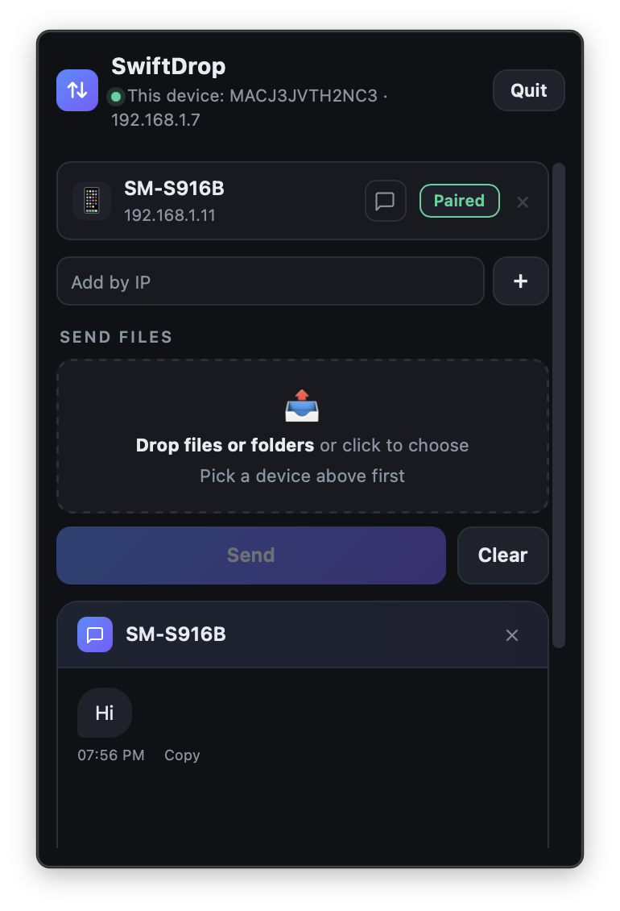
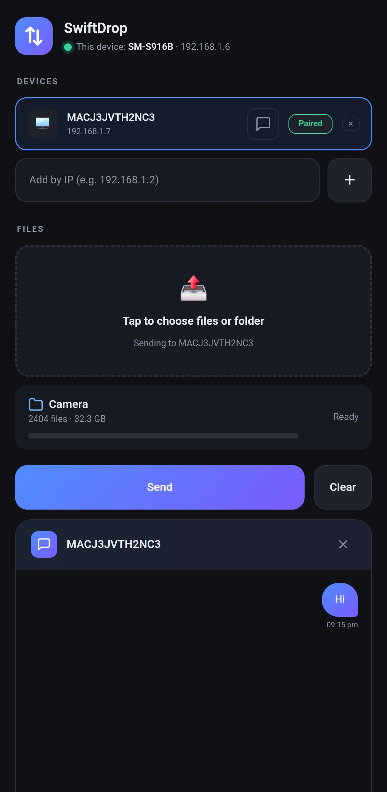

<h1 align="center">
  <br>
  SwiftDrop
</h1>

<p align="center">
  <strong>⚡ Send files, folders & messages across your devices at full LAN speed.</strong><br>
  <em>Encrypted. Private. No limits.</em>
</p>

<p align="center">
  <a href="https://github.com/dilip1232/swiftdrop/releases/latest"></a>&nbsp;
  <a href="https://github.com/dilip1232/swiftdrop/actions/workflows/ci.yml"></a>&nbsp;
  <a href="LICENSE"></a>
</p>

<p align="center">
  <a href="https://github.com/dilip1232/swiftdrop/releases/latest">📥 Download</a> ·
  <a href="#-features">Features</a> ·
  <a href="#-screenshots">Screenshots</a> ·
  <a href="#-security">Security</a> ·
  <a href="#-building-from-source">Build</a>
</p>

---

## 🤔 Why SwiftDrop?

Most file transfer apps are slow, bloated, or require accounts you don't want to create.

**SwiftDrop sends everything directly** between your devices over your local network — at the raw speed your LAN allows. A 1 GB video? About 15 seconds.

> 🚀 **70–80 MB/s** over WiFi — faster than USB 2.0 and most Bluetooth transfer apps.

---

## ✨ Features

<table>
<tr>
<td width="50%">

### 📁 Files & Folders
Drag and drop any file or entire folder. Folders are zip-streamed on-the-fly and auto-extracted on the other side.

### 💬 Built-in Chat
Message any paired device directly. No separate app needed — chat is built right into SwiftDrop.

### ⏸️ Pause & Resume
Pause a transfer mid-stream and pick up exactly where you left off.

### 🛡️ Receiver Consent
Nothing downloads without your permission. Accept or reject every incoming file.

</td>
<td width="50%">

### 🔐 End-to-End Encrypted
AES-256-GCM encryption on every transfer. SPAKE2 pairing means your PIN never crosses the wire.

### 🔍 Auto-Discovery
Devices find each other automatically via mDNS. LAN subnet scanning kicks in as a fallback.

### 📱 Cross-Platform
macOS menu bar · Windows system tray · Android native — all talk to each other seamlessly.

### 🌐 No Internet Required
Works entirely on your local network. No accounts, no sign-ups, no subscriptions.

</td>
</tr>
</table>

---

## 📸 Screenshots

<table align="center">
<tr>
<td align="center">
<strong>🍎 macOS</strong><br><br>

</td>
<td align="center">
<strong>🤖 Android</strong><br><br>

</td>
</tr>
</table>

<p align="center"><em>File transfer + chat — works the same on every platform</em></p>

---

## 📥 Download

Grab the latest release for your platform:

| Platform | Download | Notes |
|----------|----------|-------|
| 🍎 **macOS** | [SwiftDrop-2.0.0.dmg](https://github.com/dilip1232/swiftdrop/releases/latest) | Menu bar app, macOS 12+ |
| 🪟 **Windows** | [SwiftDrop-Windows-2.0.0.exe](https://github.com/dilip1232/swiftdrop/releases/latest) | System tray app, Windows 10+ |
| 🤖 **Android** | [SwiftDrop-2.0.0.apk](https://github.com/dilip1232/swiftdrop/releases/latest) | Android 8.0+ |

---

## 🔐 Security

SwiftDrop was built with a **zero-trust LAN** mindset — every connection is authenticated and encrypted, even on your home network.

| Layer | Protection |
|-------|------------|
| **Pairing** | SPAKE2 PAKE — PIN-based, PIN never leaves your device |
| **Encryption** | AES-256-GCM on every file transfer |
| **Authentication** | HMAC on every API request |
| **Key Storage** | macOS Keychain · Windows DPAPI · Android EncryptedSharedPreferences |
| **Replay Protection** | Nonce cache prevents replay attacks |
| **UI Access** | Loopback-only — web UI only accessible from localhost |

---

## 🏗️ Architecture

```
swiftdrop/
├── core/       → Shared Go module — discovery, transfers, encryption, chat, pairing
├── mac/        → macOS menu-bar app (Wails v3)
├── windows/    → Windows system tray app (Wails v3)
├── android/    → Android app (Kotlin)
└── .github/    → Unified CI + single-version release workflow
```

**One repo, one version, one release.** Every release produces a DMG, EXE, and APK — all from the same tag.

---

## 🛠️ Building from Source

### Prerequisites
- **Go 1.25+** — for core, mac, windows
- **JDK 17 + Android SDK** — for android

### macOS
```bash
cd mac
bash dev-deploy.sh   # builds, signs, installs to ~/Applications, launches
```

### Windows
```bash
cd windows
go build -ldflags "-s -w -H windowsgui" -o SwiftDrop.exe .
```

### Android
```bash
cd android
./gradlew assembleDebug
```

---

## 🤝 Contributing

1. Fork the repo
2. Create a feature branch from `dev` (`git checkout -b feature/my-feature dev`)
3. Commit your changes
4. Open a PR to `dev`

See [open issues](https://github.com/dilip1232/swiftdrop/issues) for ideas on what to work on.

---

## 📄 License

[MIT](LICENSE) — use it however you want.

---

<p align="center">
  <strong>⚡ Stop waiting for uploads. Send at LAN speed.</strong><br><br>
  <a href="https://github.com/dilip1232/swiftdrop/releases/latest">Download SwiftDrop →</a>
</p>
